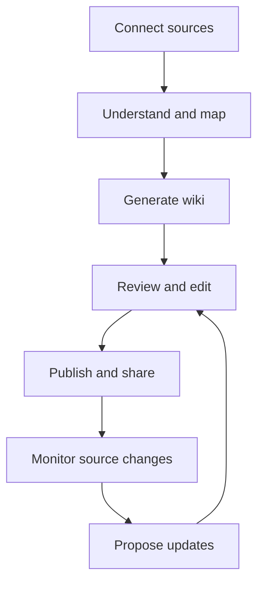

# One Wiki Master Plan

## Product Master Plan

**Status:** Product strategy and implementation roadmap  
**Product:** One Wiki  
**Descriptor:** The OneWiki  
**Ecosystem:** OWeb / One OS  
**Core promise:** Turn any source into trustworthy, living knowledge.

---

## 1. Executive decision

One Wiki should not be positioned as another GitBook clone or merely as a rebranded DeepWiki Open deployment.

It should combine three products that are normally separate:

1. **DeepWiki-style generation:** Understand an entire repository and automatically create explanations, architecture pages, diagrams, citations, and code Q&A.
2. **GitBook-style documentation:** Let teams edit, organize, review, publish, brand, protect, and measure professional documentation.
3. **OWeb intelligence:** Ingest repositories, documents, websites, cloud drives, notes, conversations, and business systems into one continuously synchronized knowledge layer that both people and AI agents can use.

The wedge is automatic wiki generation. The destination is the knowledge layer for One OS.

> **One Wiki is GitBook meets DeepWiki for every kind of organizational knowledge.**

---

## 2. Market position

### GitBook

GitBook is strongest after a team has decided to document something. It provides a polished editor, structured documentation spaces, publishing, Git synchronization, collaboration, permissions, API documentation, analytics, AI answers, MCP access, and maintenance workflows.

### DeepWiki Open

DeepWiki Open is strongest before documentation exists. It analyzes a software repository, discovers its structure, generates wiki pages and diagrams, cites the underlying code, and lets users ask questions about the codebase.

### One Wiki

One Wiki should own the full lifecycle:

One Wiki's defining advantage is not simply that it can publish documentation. It is that it can create, ground, combine, and maintain documentation from the systems where knowledge already lives.

---

## 3. Capability comparison

Legend: **Strong** = mature/core capability; **Partial** = present but limited; **Missing** = must be built; **One Wiki target** = desired product behavior.

| Capability | DeepWiki Open | GitBook | One Wiki target |
|---|---|---|---|
| Analyze an entire codebase | **Strong** | Partial | **Strong** |
| Generate a wiki from source code | **Strong** | Partial | **Strong** |
| Source-grounded code citations | **Strong** | Partial | **Strong** |
| Architecture and dependency diagrams | **Strong** | Partial | **Strong** |
| Codebase Q&A | **Strong** | **Strong** for authored docs | **Strong across all sources** |
| GitHub, GitLab, Bitbucket ingestion | **Strong** | **Strong** Git sync for documentation | **Strong** |
| Visual block editor | Missing/limited | **Strong** | **Strong** |
| Manual wiki creation | Partial | **Strong** | **Strong** |
| Page tree and information architecture | Partial | **Strong** | **Strong** |
| Reusable content and custom blocks | Missing | **Strong** | Phase 2 |
| Public documentation publishing | Partial | **Strong** | **Strong** |
| Private/authenticated publishing | Partial | **Strong** | **Strong** |
| Custom domains and branding | Missing/limited | **Strong** | **Strong** |
| Comments, review, and approvals | Missing | **Strong** | Phase 2 |
| Roles and granular permissions | Missing/limited | **Strong** | **Strong** |
| Version history and rollback | Missing/limited | **Strong** | **Strong** |
| Branch/change-request workflow | Missing | **Strong** | Phase 2 |
| Bidirectional docs-as-code sync | Missing/limited | **Strong** | Phase 2 |
| OpenAPI/API reference rendering | Missing | **Strong** | Phase 2 |
| Search | Partial | **Strong** | **Strong hybrid search** |
| AI assistant for readers | **Strong** | **Strong** | **Strong** |
| AI writing and editing assistant | Partial | **Strong** | **Strong** |
| Stale-content detection | Missing | **Strong** | **Core differentiator** |
| Human and AI usage analytics | Missing | **Strong** | Phase 2 |
| Feedback and knowledge-gap detection | Missing | **Strong** | Phase 2 |
| MCP endpoint for AI agents | Partial/varies | **Strong** | **One MCP per wiki/workspace** |
| PDF/file ingestion | Missing/limited | Partial | **Strong** |
| Website crawling | Missing/limited | Partial | **Strong** |
| Google Drive and cloud documents | Missing | Partial/connectors | **Strong** |
| Multi-source synthesis | Missing | Partial | **Core differentiator** |
| Business-system connectors | Missing | Partial | **Native through OWeb** |
| White-label/embed options | Missing/limited | Partial | **Strong** |
| Multi-tenant SaaS foundation | Missing/limited | **Strong** | **Strong** |

### Product conclusion

DeepWiki Open supplies the hardest early technical capability: turning complex source code into navigable, cited explanations. It does **not** supply the complete product surface required to replace GitBook. One Wiki must build a durable content platform around that engine.

---

## 4. Product pillars

### Pillar 1: Generate

Users can create a complete wiki by connecting one or more sources:

- GitHub, GitLab, or Bitbucket repositories
- PDFs, Word files, Markdown, text, and spreadsheets
- Websites and sitemaps
- Google Drive folders and documents
- Uploaded audio transcripts and meeting notes
- Existing GitBook, Notion, or documentation exports
- OWeb applications and business data
- A blank wiki or guided prompt

The result must include a proposed page tree, summaries, detailed pages, diagrams, a glossary, source citations, and unresolved questions.

### Pillar 2: Author

One Wiki needs a first-class visual editor—not just generated Markdown.

Required authoring functions:

- Slash-command block editor
- Markdown shortcuts and import/export
- Headings, tables, callouts, tabs, code blocks, media, embeds, diagrams, and reusable snippets
- AI rewrite, expand, summarize, translate, and explain
- Page tree, drag-and-drop organization, templates, drafts, and autosave
- Source panel showing evidence behind generated statements
- Human-authored and AI-generated content clearly distinguishable in history

### Pillar 3: Verify

Trust must be part of the interface.

Every generated claim should be able to show:

- Its source
- The source version or commit
- When it was last verified
- Whether the source has changed
- Confidence or evidence coverage
- Who approved the published version

One Wiki should never silently overwrite approved human content. Source changes create proposed updates or review tasks.

### Pillar 4: Publish

Each wiki can be:

- Private to an OWeb workspace
- Shared by invitation
- Published publicly
- Protected by password, workspace membership, or application authentication
- Hosted on a One Wiki subdomain or custom domain
- Embedded inside Salesflow, another OWeb app, or an external product
- Exposed to AI agents through MCP and API access

### Pillar 5: Maintain

One Wiki continuously watches connected sources and identifies:

- Outdated pages
- Broken citations or deleted sources
- New functionality not yet documented
- Conflicting statements across sources
- Frequently asked questions with weak answers
- Pages that users search for but cannot find

It then proposes patches for review rather than regenerating the entire wiki.

---

## 5. The three creation modes

The initial creation screen should present three simple paths.

### Generate

**“Connect what you already have.”**

The user connects repositories, files, Drive, or websites. One Wiki inventories the sources, proposes the wiki structure, estimates generation cost/time, and produces a reviewable first draft.

### Write

**“Start with a blank page or template.”**

The user creates a manual documentation space with GitBook-quality editing and publishing.

### Unify

**“Bring scattered knowledge together.”**

The user connects multiple source types. One Wiki resolves duplicates, detects contradictions, creates a unified taxonomy, and preserves citations back to every system of record.

Generate is the launch wedge. Write makes the product complete. Unify becomes the moat.

---

## 6. Recommended architecture

### Deployment model

| Layer | Recommended platform | Responsibility |
|---|---|---|
| Web application | Vercel | Next.js interface, public wiki rendering, editor shell |
| Core API | OWeb service layer / container host | Authentication-aware application API |
| Ingestion and generation workers | Coolify, Railway, or equivalent containers | Repository cloning, crawling, parsing, embeddings, long AI jobs |
| Primary data | Shared Supabase | Workspaces, permissions, pages, versions, sources, jobs, comments |
| Object storage | Supabase Storage | Uploaded files, generated assets, exports, snapshots |
| Search and retrieval | Postgres full-text + pgvector initially | Hybrid keyword and semantic retrieval |
| Job orchestration | Durable queue/workflow service | Retries, progress, cancellation, scheduled re-indexing |
| AI routing | OWeb model gateway | Model selection, cost controls, observability, fallbacks |
| Connectors | OWeb integration/context layer | Git providers, Drive, websites, business systems |

### Core domain objects

- **Workspace:** OWeb tenant and billing boundary
- **Wiki:** Knowledge product containing spaces and sources
- **Space:** Publishable collection of pages
- **Page:** Editable content unit
- **Block:** Structured content inside a page
- **Source:** Repository, file, URL, connector, or manual source
- **Source snapshot:** Immutable version used for citations
- **Citation:** Link between a claim/block and source fragment
- **Generation:** AI operation with model, cost, status, and provenance
- **Version:** Immutable page revision
- **Change proposal:** Suggested update awaiting review
- **Publication:** Public/private deployed representation
- **Assistant index:** Retrieval configuration for search, chat, API, and MCP

### Important architectural rule

Store canonical wiki content in One Wiki's structured content model. Markdown should be an import/export and Git-sync format—not the only database representation. This enables visual editing, permissions, reusable blocks, citations, comments, and precise AI patches.

---

## 7. DeepWiki Open adoption plan

### Retain or adapt

- Repository acquisition and provider support
- Code parsing and repository structure analysis
- Wiki outline generation
- Page-generation prompts and pipelines
- Mermaid/architecture diagram generation
- Source-grounded code references
- Repository Q&A patterns
- Model-provider abstraction where useful

### Replace or isolate

- Single-user assumptions
- Local filesystem as durable state
- Monolithic synchronous generation
- Direct coupling between generated output and presentation
- Any authentication or token-handling unsuitable for multi-tenancy
- Temporary caching that cannot survive deployment restarts
- UI components that prevent a consistent OWeb design system

### Add around it

- Tenant-safe job service
- Structured page and citation schema
- Durable source snapshots
- Cost metering and quotas
- Provider token vault and GitHub App installation flow
- Incremental re-indexing by commit/diff
- Reviewable change proposals
- Observability, retries, cancellation, and failure recovery

DeepWiki Open should initially live behind a stable internal `generation-service` contract. That allows One Wiki to improve or replace individual parsing, retrieval, and generation components without rewriting the editor or publishing platform.

---

## 8. Roadmap

## Phase 0 — Technical validation

**Goal:** Prove that DeepWiki Open can become a safe multi-tenant engine before designing the full product around it.

Deliverables:

- Deploy the unmodified project in a private development environment
- Generate wikis from three representative repositories: small, medium, and large
- Measure generation duration, tokens, model cost, storage, failure rate, and output quality
- Audit the MIT-licensed code and all dependency licenses
- Trace how repositories, credentials, generated pages, and caches are stored
- Identify synchronous calls and local-filesystem dependencies
- Define the internal generation-service API
- Produce a keep/replace/refactor decision for every major subsystem

**Exit criteria:** A medium repository completes reliably, output has traceable citations, no tenant data leaks, and projected cost is acceptable.

## Phase 1 — One Wiki MVP: Generate and publish

**Goal:** Deliver the magical first-use experience.

Scope:

- OWeb authentication and workspace tenancy
- Create a wiki from a public GitHub repository
- Optional GitHub App connection for private repositories
- Proposed outline before generation
- Background generation with live progress and cancellation
- Generated pages, diagrams, citations, and repo chat
- Basic page-tree management and Markdown-capable editing
- Public/private publishing
- One Wiki subdomain and basic custom branding
- Search and AI Q&A
- Usage metering, generation limits, and billing hooks
- Export to Markdown

**Explicitly defer:** Full Git sync, enterprise approvals, reusable blocks, OpenAPI references, advanced analytics, and dozens of connectors.

**MVP success moment:** A user pastes a repository URL and receives a useful, editable, publishable wiki without writing the documentation manually.

## Phase 2 — GitBook parity where it matters

**Goal:** Make One Wiki a credible daily documentation platform rather than a one-time generator.

Scope:

- Production-quality visual block editor
- Page version history and rollback
- Comments, suggestions, mentions, and assignments
- Roles: owner, admin, editor, reviewer, viewer
- Draft, review, approve, and publish workflow
- Custom domains and authenticated documentation
- Full-text and semantic search controls
- Templates and reusable content
- Reader feedback and search analytics
- AI query analytics and knowledge-gap detection
- OpenAPI import and interactive API reference pages
- Bidirectional Git synchronization for documentation content
- Webhooks, content API, and one MCP endpoint per published wiki

**Exit criteria:** A team can operate One Wiki as its primary documentation system without needing GitBook for standard workflows.

## Phase 3 — The OneWiki: multi-source knowledge

**Goal:** Move beyond the GitBook category.

Scope:

- PDFs, Office files, Markdown folders, and bulk uploads
- Website crawling and scheduled refresh
- Google Drive ingestion and synchronization
- Notion and GitBook migration/import
- Meeting transcript and recorded-conversation ingestion
- Multi-source taxonomy generation
- Duplicate and contradiction detection
- Source priority rules and authoritative-source designation
- Cross-wiki search and answers
- Suggested updates from source changes
- Embeddable assistant and knowledge widgets

**Exit criteria:** A nontechnical company can create a reliable internal or customer-facing wiki without having a software repository.

## Phase 4 — Living knowledge and OWeb intelligence

**Goal:** Establish One Wiki as the knowledge layer for One OS.

Scope:

- Native context from Salesflow and other OWeb applications
- Permission-aware retrieval across the OWeb workspace
- AI-agent access through MCP and APIs
- Automated change proposals triggered by product or process events
- Knowledge health score: freshness, coverage, conflicts, broken citations, unanswered questions
- Agent feedback loops showing which knowledge produced successful outcomes
- Workflow actions: create task, request review, notify owner, update training, publish release notes
- White-label One Wiki for clients and agencies

**Exit criteria:** OWeb agents use One Wiki as their governed source of truth rather than repeatedly reconstructing context from raw applications.

---

## 9. Prioritization: what to copy, match, and surpass

### Copy the category expectations

These are table stakes and should feel familiar:

- Clean page tree
- Excellent editor
- Search
- Public/private publishing
- Custom domains
- Version history
- Roles and permissions
- Comments and reviews
- API documentation
- Analytics
- Git sync

### Match later, not at launch

- Enterprise SSO and SCIM
- Complex branch workflows
- Large marketplace of custom components
- Extensive localization management
- Fine-grained compliance administration

### Surpass immediately

- Whole-codebase understanding
- Automatic architecture documentation
- Claim-level source citations
- Wiki generation from a URL
- Transparent generation progress and cost
- AI assistant grounded in both authored content and raw sources

### Build as the long-term moat

- Multi-source unification
- Incremental change detection
- Reviewable AI maintenance
- Contradiction detection
- Knowledge health scoring
- Native OWeb context and agent access
- One governed knowledge layer across an organization

---

## 10. UX blueprint

### Home

- Recent wikis
- Create Wiki button
- Needs Review queue
- Source health alerts
- Usage and generation status

### Create Wiki

1. Choose Generate, Write, or Unify
2. Connect source(s)
3. Choose audience: developers, employees, customers, students, or custom
4. Review detected topics and proposed outline
5. Select depth: overview, standard, or exhaustive
6. Review estimated usage
7. Generate in background

### Wiki workspace

- Left: page tree and sources
- Center: rendered page/editor
- Right: outline, citations, page status, AI actions, and review controls
- Top: search/Ask One Wiki, preview, share, and publish

### Needs Review

A single operational queue containing:

- Source changed
- Citation broken
- AI proposed an update
- Reviewer requested changes
- Contradiction detected
- Page has not been verified within its freshness policy

This queue is strategically important: it converts documentation maintenance from a vague responsibility into manageable work.

---

## 11. Permissions and trust model

Permission checks must apply at ingestion, retrieval, generation, chat, publishing, API, and MCP layers.

Rules:

- A user cannot receive an answer derived from a source they cannot access.
- Public wiki indexes must never contain private drafts or source fragments.
- Connector tokens must be encrypted and scoped to the minimum permissions.
- Private repositories should use a GitHub App rather than asking users to paste broad personal access tokens.
- Every AI update records the model, prompt version, source snapshot, cost, author, reviewer, and timestamp.
- Deleted sources should not silently erase approved pages; they should create a broken-evidence alert.
- Published content should have a rollback path.

---

## 12. Pricing architecture

Charge for the value-driving constraints rather than simple page count.

### Free

- Public wikis
- One workspace
- Limited generation credits
- One Wiki branding
- Community support

### Pro

- Private wikis
- Custom domains
- Larger source limits
- Scheduled refresh
- More AI usage
- Basic analytics

### Team

- Multiple members
- Reviews and permissions
- Git/Drive synchronization
- Usage analytics
- API and MCP access
- Advanced publishing controls

### Business/Enterprise

- SSO/SCIM
- Audit logs
- Data controls and retention policies
- Dedicated generation capacity
- White-labeling
- Advanced security and support

Meter separately or enforce quotas for repository size, indexed source volume, generation tokens, refresh frequency, storage, and assistant usage. Never offer unlimited expensive generation without safeguards.

---

## 13. Success metrics

### Activation

- Percentage connecting a first source
- Percentage reaching a generated preview
- Time from source connection to first useful page
- Percentage publishing or inviting a teammate

### Quality

- Citation coverage
- Human approval rate of generated pages
- Percentage of proposed updates accepted
- Answer helpfulness and grounded-answer rate
- Regeneration and manual-correction rate

### Engagement

- Weekly active editors and readers
- Searches and Ask One Wiki sessions
- Pages reviewed per workspace
- Connected sources per wiki
- MCP/API queries from agents

### Retention and business

- Wikis still synchronized after 30/90 days
- Workspaces with multiple contributors
- Conversion by repository/source size
- Gross margin after model and indexing costs
- Expansion from Generate into Write, Unify, or agent access

---

## 14. Major risks and controls

| Risk | Control |
|---|---|
| Attempting full GitBook parity before launch | Ship the generation wedge first; defer enterprise features |
| Hallucinated documentation | Require citations, confidence signals, snapshots, and review workflows |
| Runaway model costs | Estimates, budgets, quotas, caching, smaller models, incremental updates |
| Large repositories exceed job limits | Background workers, chunking, resumable jobs, repository filters |
| Private-code exposure | Tenant isolation, GitHub App scopes, encryption, audit logs, permission-aware retrieval |
| Generated wiki goes stale | Commit monitoring, source diffs, freshness policies, review queue |
| Fork becomes hard to maintain | Isolate DeepWiki behind internal contracts; avoid deep UI coupling |
| Weak non-code experience | Phase 3 connectors plus templates for SOPs, training, support, and business knowledge |
| Confusing overlap with oBrain | One Wiki owns governed knowledge; oBrain consumes and reasons across knowledge and live context |
| Commodity feature competition | Build multi-source synthesis, maintenance, provenance, and OWeb-native workflows |

---

## 15. Recommended product boundaries

### One Wiki owns

- Durable, structured organizational knowledge
- Wikis, documentation, manuals, SOPs, training, and knowledge bases
- Source citations, versions, publishing, governance, and freshness
- Knowledge retrieval interfaces for people and agents

### oBrain owns

- Cross-application reasoning
- Live operational context
- Agent memory and orchestration
- Decisions and actions using One Wiki plus real-time systems

### Salesflow and other OWeb apps own

- Operational records and workflows
- Domain-specific actions
- Events that can trigger One Wiki update proposals

This avoids building two competing “knowledge” products. One Wiki is the trusted library; oBrain is the intelligence that uses it.

---

## 16. First 30 days

### Week 1: Validate the engine

- Deploy DeepWiki Open privately
- Test three repository sizes
- Document cost, speed, quality, and failure modes
- Audit storage and credential handling
- Confirm dependency licensing

### Week 2: Define One Wiki's foundation

- Finalize the domain model
- Define generation-service APIs
- Create OWeb tenant/auth integration design
- Design source snapshot and citation schemas
- Create the first OWeb design-system wireframes

### Week 3: Build the vertical slice

- Paste a public GitHub URL
- Start a background generation job
- Show progress
- Persist structured wiki pages and citations
- Render page tree, diagrams, and source links

### Week 4: Make it a product

- Add basic editing
- Add public/private publishing
- Add search and Ask One Wiki
- Add usage limits and instrumentation
- Test with one OWeb repository and one external repository

At day 30, the goal is not feature completeness. The goal is one undeniable demonstration: **a repository becomes a trustworthy, editable, publishable One Wiki wiki.**

---

## 17. Final recommendation

Build One Wiki in layers:

1. **DeepWiki first:** automatic, cited repository understanding.
2. **GitBook next:** editing, collaboration, publishing, governance, and maintenance.
3. **OneWiki last:** multi-source synthesis, OWeb-native context, and governed agent access.

Do not begin by recreating GitBook page for page. Use DeepWiki Open to create an experience GitBook cannot match as quickly: connect a source and receive a credible wiki automatically. Then close the specific workflow gaps that turn that generated artifact into a lasting system of record.

**Brand statement:**

> **One Wiki: The OneWiki**  
> Turn anything into living knowledge.  
> Built on One OS.

